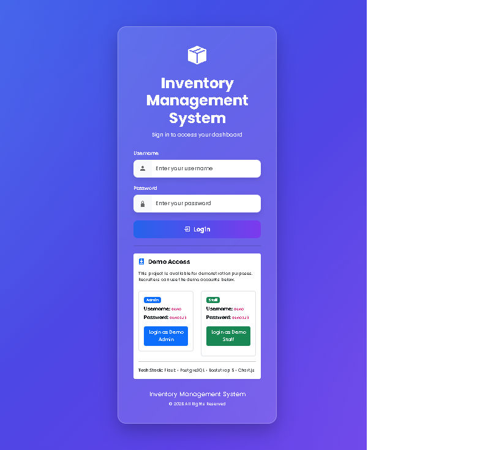
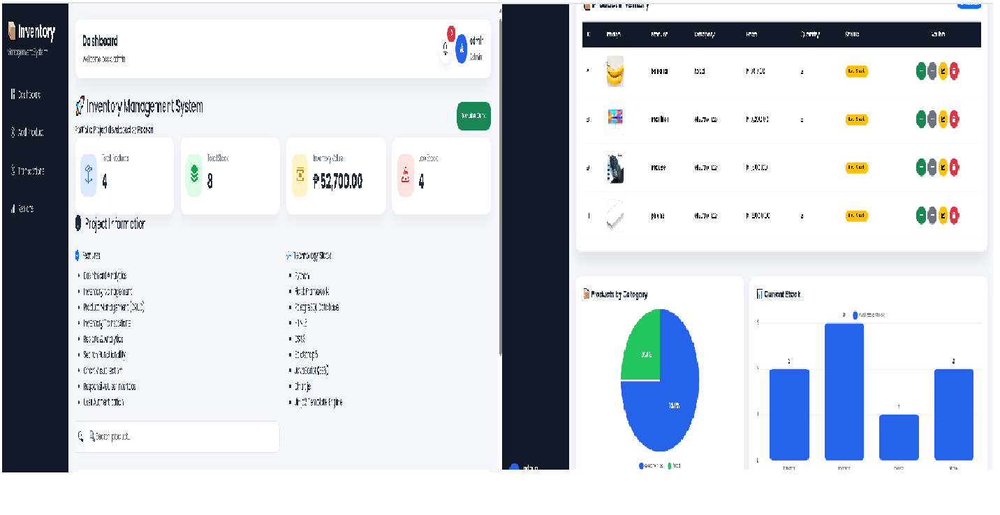
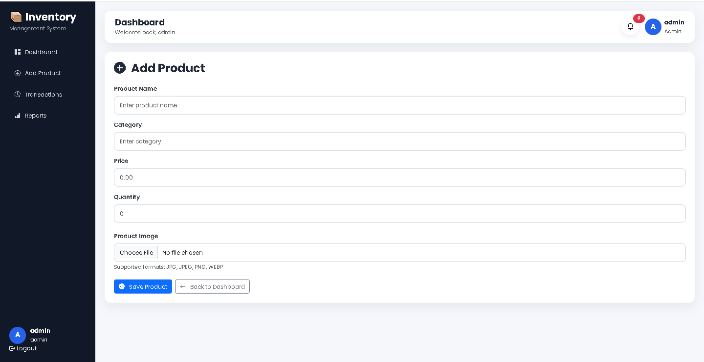
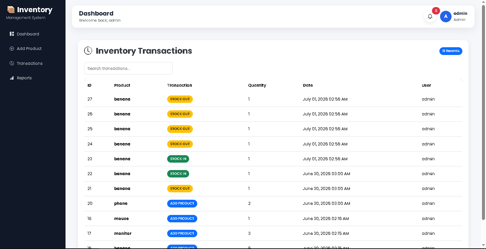
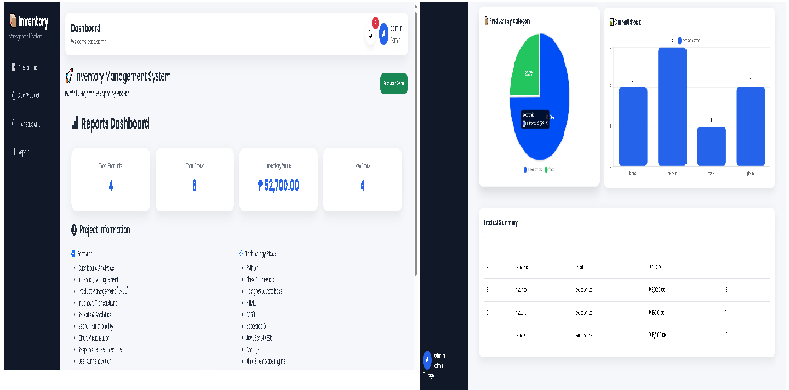

# 📦 Inventory Management System

A modern web-based Inventory Management System developed using **Python**, **Flask**, and **MySQL**. This application helps businesses efficiently manage inventory, suppliers, transactions, and reports through an intuitive dashboard.

---

## 🚀 Features

- 🔐 User Authentication
- 📊 Dashboard Analytics
- 📦 Product Management (CRUD)
- 🏷 Category Management
- 🚚 Supplier Management
- 💰 Transaction Management
- 📈 Reports & Analytics
- 🥧 Pie Chart Visualization
- 📊 Bar Chart Visualization
- 📱 Responsive User Interface

---

## 🛠 Tech Stack

| Technology | Description |
|------------|-------------|
| Python | Backend Programming Language |
| Flask | Web Framework |
| MySQL | Database |
| HTML5 | Structure |
| CSS3 | Styling |
| JavaScript | Frontend Logic |
| Bootstrap | Responsive UI |
| Chart.js | Dashboard Charts |

---

## 📂 Project Structure

```
Inventory_Web_V2/
│
├── app.py
├── requirements.txt
├── .env.example
├── README.md
├── static/
│   ├── css/
│   ├── js/
│   └── images/
│
├── templates/
│
└── database/
    └── inventory.sql
```

---

## 📸 Screenshots

### Login



### Dashboard



### Products



### Transactions



### Reports



---

## ⚙ Installation

Clone the repository

```bash
git clone https://github.com/Gdrodron/inventory-management-system.git
```

Go to the project folder

```bash
cd inventory-management-system
```

Install dependencies

```bash
pip install -r requirements.txt
```

Run the application

```bash
python app.py
```

---

## 📌 Future Improvements

- Export PDF
- Export Excel
- Barcode Scanner
- Email Notifications
- Role-Based Access Control
- REST API

---

## 👨‍💻 Author

**Rodron Camangyan**

GitHub: https://github.com/Gdrodron

---

## 📄 License

This project is licensed under the MIT License.
